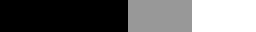

# Assignment 5: Artistic Rendering

**Due: Wednesday, April 10, 11:59pm CDT**

GLSL shaders make it possible for us to create some amazing lighting effects in real- time computer graphics. These range from photorealistic lighting to artistically inspired non-photorealistic rendering, as featured in games like *The Legend of Zelda: Breath of the Wild* and *Team Fortress 2*. In this assignment, you will implement GLSL shaders that can produce cartoon shading with a silhouette outline to complete the artistic effect.  You will also complete the implementation of a normal mapping shader that can render photorealistic textures on surfaces to make them appear more detailed and complex.

In this assignment, you will learn:

- How to calculate artistic per-pixel lighting in real-time.
- How to modify geometry on the fly to create viewpoint-dependent effects such as silhouette outlines.
- How to manipulate per-pixel normals to create the illusion of more complex surfaces.
- How to implement and use your own shader programs!

You can try out the [instructor's implementation](https://csci-4611-spring-2024.github.io/Assignments/Assignment-5/dist) in the Builds repository on the course GitHub.

## Repository Setup

We are using GitHub classroom for submission of programming assignments.  When you accept the first assignment, you will need to select your x500 from the class roster. The system will then create a new private repository with template code that is only accessible by you, the instructor, and the TAs. You will need to create a GitHub.com account if you do not already have one.  Note that this is different from the University's github.umn.edu account.  

**Step 1:** Create your private repository using the following link: TO BE ADDED

**Step 2:** Your repository will be added to the [GitHub course organization](https://github.com/CSCI-4611-Spring-2024).  You will need to open your repository on GitHub, then go to Settings->Pages and change the build and deployment source to `GitHub Actions`, as shown in the image below.  You **must** complete this step or you will not be able to to deploy the finished assignment.

**Step 3:** Check out the code to your local machine **using a git client**. If you are not familiar with using `git` from the command line, then I recommend using a GUI-based client such as [GitHub Desktop](https://desktop.github.com/), [GitKraken](https://www.gitkraken.com/), or the [GitLens](https://marketplace.visualstudio.com/items?itemName=eamodio.gitlens) extension for VS Code. 

Do **not** simply download the contents of your repository as a ZIP file!  This is not the right way to use version control, and you will be unable to push your local changes back to the GitHub repository. 


## Prerequisites

To work with this code, you will first need to install [Node.js 20.11.0 LTS](https://nodejs.org/en/) (or newer) and [Visual Studio Code](https://code.visualstudio.com/). 

I also recommend you install the following useful VS Code extensions:

- [GitLens](https://marketplace.visualstudio.com/items?itemName=eamodio.gitlens) (makes source control easier)
- [ESLint](https://marketplace.visualstudio.com/items?itemName=dbaeumer.vscode-eslint) (static code analysis tool that can flag errors)
- [JavaScript Debugger](https://marketplace.visualstudio.com/items?itemName=ms-vscode.js-debug-nightly) (essential for real-time debugging)
- [WebGL GLSL Editor](https://marketplace.visualstudio.com/items?itemName=raczzalan.webgl-glsl-editor) (used for programming shaders later in the course)

## Getting Started

The starter code implements the general structure that we reviewed in lecture.  After cloning your repository, you will need to set up the initial project by pulling the dependencies from the node package manager with:

```
npm install
```

This will create a `node_modules` folder in your directory and download all the dependencies needed to run the project.  Note that this folder is listed in the `.gitignore` file and should not be committed to your repository.  After that, you can compile and run a server with:

```
npm run start
```

Your program should open in a web browser automatically.  If not, you can run it by pointing your browser at `http://localhost:8080`.

## Useful Resources

he support code for this assignment will load several 3D model files and make it possible for you switch which one is being displayed, rotate it around with the mouse, and cycle between several different options for drawing the model with different shaders. Two shading modes (wireframe and unlit) are already implemented for you using built-in GopherGfx shaders. Your assignment is to implement four additional shading modes that take lighting into account in various ways. The first two of these will be the easiest because we will work on these in class.  Together, we will write a Gouraud shader that computes per-vertex lighting and a Phong shader that computes per-pixel lighting. The bulk of your assignment will be working on the second two shading modes, which build on these concepts to implement a cartoon-style artistic effect and normal mapping to produce detailed per-pixel variation in lighting on bumpy surfaces.

In addition to slides and examples from class, the [OpenGL 3.0 ES API Reference Card](https://www.khronos.org/files/opengles3-quick-reference-card.pdf) also provides a compact and useful resource for all the various functions provided by the shading language.  Note that the first three pages can be ignored, and the content relevant to GLSL is on pages 4-6.

## Program Requirements

For this assignment, you only need to modify the GLSL code in the `.vert` and `.frag` shader programs, which are located in `src/shaders`. However, as always, you are welcome to add to the TypeScript code if you want to add additional wizard functionality.

#### 1. Gouraud and Phong Shaders

We will work together in class to write a Gouraud shader and a Phong shader. Incorporating these into your code is worth one just point each because you can literally write them during class or even copy them from the implementations provided inthe GopherGfx library. However, **it is really important that you understand every line of code in these basic shaders before you try to implement more complex shaders.** So, please do not quickly copy and paste the code. Instead, go through the effort of actually typing each line of code into your solution. If you are struggling to understand how either these two shaders work, then you can make a post on Piazza or ask a TA to the walk you through the code during office or whiteboard hours.

#### 2. Artistic Cartoon Shading Using Texture Images

The strategy we will take to implement cartoon shading is quite flexible because rather than hard-coding the logic of the toon shading directly in the shader code (e.g., how many distinct colors to use for the cartoon effect), we will provide this data to the shader in the form of a "ramp" texture. With this approach, you can create hundreds of different shading effects with the same shader, just by swapping in/out different ramp textures!

Cartoon shading effects are widely used in games, as shown below.  *The Legend of Zelda: The Wind Waker* uses a very simplified light model. In this example, it looks like there are just two values used in the shading: each surface is either in bright light or dark. *Team Fortress 2* is a bit more subtle: it reduces the brightness variation in lit areas without completely flattening them out. You can read more about this in [Illustrative Rendering in Team Fortress 2](https://valvearchive.com/archive/Other%20Files/Publications/NPAR07_IllustrativeRenderingInTeamFortress2.pdf) by Mitchell et al.


To implement cartoon shading in code, the vertex program can be the same as the Phong vertex shader described above. Much of the lighting calculation in the fragment shader will also be the same, but we will make a few tweaks.

Specifically, for the diffuse and specular components, our strategy will be to calculate the *light intensity* using the typical Phong model. However, instead of using these intensity values directly, we will use them as a lookup into a texture. Suppose that we use the dot product used to compute the diffuse lighting component, **n** &middot; **l**, to look up the texture.  Because this value represents the cosine of the angle between the two vectors, it will range from -1 to 1. We need to map this value to a texture coordinate, which will range from 0 to 1. 

If we use `standardDiffuse.png`, which is zero in the left half (corresponding to negative **n** &middot; **l**), and increases linearly from 0 to 1 in the right half (corresponding to positive **n** &middot; **l**), then we will get back the standard diffuse lighting term.  In other words, the object will have the same appearance as the Phong shader.


However, if we use `toonDiffuse.png`, we will get something that looks like a cartoon, as if an artist were shading using just three colors of paint.



It is worth noting that we could just hardcode these steps into the shader. For example, using an `if` statement to check the value of **n** &middot; **l** to see if it is between -1 and 0, 0 and 0.5, or 0.5 and 1.0, and then setting the output color to one of three predetermined values. However, using a texture as a lookup makes it really easy to create a wide variety of effects with a single shader just by switching the lookup texture. For example, we can easily add more bands of gray to the example image above, and it would look like the artist shaded the model using more markers. The starter code includes some extra ramp textures you can experiment with to try out different effects, and you can certainly try creating your own textures as well. Writing the shader this way is also a great learning tool because many advanced shaders rely upon this strategy of using a texture to provide more abstract "input data" to achieve various visual effects.

In terms of the actual implementation, you should write your shader in the `toon.vert` and `toon.frag` files.  As a first step, you should copy the contents of your Phong shaders into the `main()` function. You can then isolate the math that calculates the *diffuse light intensity* and *specular light intensity* and use these values for your texture lookups.

For the diffuse component, the *diffuse light intensity* to use for the texture lookup will be **n** · **l**.  Because this value represents the cosine of the angle between the two vectors, it will range from -1 to 1, which is not quite the correct range for *uv* texture coordinates. So, you will need to convert this to the correct texture coordinates. Remember, you want your texture coordinates to work so that if the value of **n** · **l** is −1, then you use the color on the leftmost side of the texture. If it is 1, then you use the color on the rightmost side of the texture. 

Also, note that the color in these ramp textures only varies from left to right, so the *v* texture coordinate (the up-down coordinate) really does not matter. You could use 0.0 0.5, 1.0 -- any value for *v* should produce the same results. The key is to calculate the correct value for the *u* texture coordinate. Use the GLSL built-in function `texture()` to get the color from the ramp image at the coordinates you calculate.

For the specular component, you should use the same strategy with just a couple of differences. First, remember, the *specular light intensity* is calculated using a slightly different equation. Also, this equation will typically include something like max(0, *specularIntensity*), effectively trimming the range of the function to 0 to 1. The specular ramp textures are designed to match this range, with 0 intensity on the left of the image and +1 intensity on the right of the image. So, you can use this 0...1 value directly when doing your texture lookup.

When you get to this point in your implementation of the assignment, you should check your result against the following reference images (and the instructors' implementation). With the sphere mesh selected, the rendering should look like similar to the following as you progress through the assignment:


1. The sphere rendered with the Unlit shader provided by GopherGfx.
2. The sphere with Gouraud shading.
3. The sphere with Phong shading. Also the same as cartoon shading using the `standardDiffuse.png` and `standardSpecular.png` ramps. To test this, you can switch the texture ramps loaded by the `ToonMaterial` during program initialization.
4. Cartoon shading with `toonDiffuse.png` and `toonSpecular.png`.
5. Cartoon shading with a silhouette outline of thickness 0.01 (described in the next section).

#### 3. Silhouette Outline Rendering using Stencil Buffers

Many art-based rendering techniques require what we call a two-pass rendering approach. In other words, the mesh you are rendering is drawn twice with different rendering settings each time. We will use this approach to add a silhouette outline to our toon rendering style. In *Pass 1*, we will render the mesh using the `toon.vert` and `toon.frag` shader programs that were implemented in the previous part of the assignment. Then, in *Pass 2*, we will render the same mesh again but this time with the outline.vert and outline.frag shader programs. The TypeScript support code already handles calling these two passes automatically for you whenever you select the Toon shading model (feel free to take a look at `OutlineMaterial.ts` if you are interested in learning how this is done). However, the outline shader will not have any effect until you complete the  `outline.vert` shader code in this portion of the assignment.

Getting an outline to show up around a mesh is a bit tricky because this means we need some graphics to show up in places where we do not already have vertices. It's almost like we want to draw a "bigger" or "inflated" version of the mesh with a black marker (and no lighting) and then draw a regular version of the mesh on top of it, something like this:


**In computer graphics this would almost work, but not quite. If we just "inflate" the mesh to create the bigger black mesh, it would then completely surround the toon-shaded mesh, hiding it from view. To address this, we need to do two things:

1. Rather than "inflating" the mesh equally in all directions, we inflate it only in the horizontal and vertical directions (relative to the camera) and not in the camera's depth direction. This is easiest to do after converting the mesh vertices to the camera's *View Space* coordinate system because the depth direction is always the Z-axis in View Space. 
2. Apply a "stencil" to mask out the shape of the toon-shaded teapot so that when we draw the black teapot geometry is does not cover up any of the toon-shaded teapot's pixels.  The starter code always implements this for you in `OutlineMaterial.ts`.

**The part you need to complete for this assignment is to implement #1 in `outline.vert`.**  To "inflate" the mesh, you will need to move each of its vertices slightly. You can do this in a vertex shader. Remember, this is where we calculate the position of each vertex on the screen, so if we just change that calculation slightly by moving each vertex "outward" by some small amount, we can get the effect of "inflating" the mesh. 

The most complex aspect is to determine the direction of movement for each vertex. Each vertex has a normal vector, which conveniently points directly "outward". However, remember from the earlier discussion that we do not want to move the vertex in the camera's depth direction. So, we need to find a modified version of the normal that does not include this depth component. In World Space, the camera could be oriented in any direction, so the "depth direction" will be some arbitrary vector, and this makes the problem a bit complicated. However, remember the steps in the graphics pipeline that we have gone over in class and in the lecture slides.  In a vertex shader, a vertex position will be converted from Model Space to World Space, then to View Space, and then finally transformed by the projection matrix.  When the vertex position is in View Space, the camera is always located at the origin, looking down the negative Z-axis. So, in View Space, the camera's depth direction is very well defined; it is simply the Z-axis.

If we transform a normal direction to View Space, we can ignore the "depth" direction of that normal simply by ignoring its Z component. Once you have a point and a direction and amount to move it, computing the new position for the point follows the same strategies for working with points and vectors that we have been practicing all semester. Just remember to make sure that whenever you add points and vectors, they are both expressed in the same coordinate space.  

After calculating the "revised" position for the vertex, remember to complete the job of the vertex shader by applying the projection matrix and sending the result on to the next stages of the pipeline. Note that all the work you need to do for this part will be in `outline.vert`.  The fragment shader is trivial because everything is drawn in a solid black color, so you won't need to modify `outline.frag`.

**How does the silhouette outline get combined with toon shading?** 

You do not need to implement this part, but you should understand how the rendering technique combines the two shaders you have written. It uses a new concept called *stencil testing*. 

To understand stencil tests, you need to understand that, internally, low-level graphics systems store the pixel colors we see on the screen in a buffer in memory that, like a standard image file format is just a long array of R,G,B,A values. This is called the *Color Buffer,* and it has one color for every pixel in the graphics window. Most 3D graphics programs also have a *Depth Buffer* that stores the approximate depth (away from the camera) for each pixel. And, finally, there is an optional *Stencil Buffer*. These buffers are always the exact same dimensions as the Color Buffer. So, every Pixel in the Color Buffer has a corresponding pixel in the Depth Buffer and in the Stencil Buffer.  The purpose of these "extra" buffers is to allow us to store some extra data for each pixel, which we check in the final steps of rendering.

Specifically, the Stencil Buffer can be used to add a test for each fragment that either passes (the fragment will be drawn into the Color Buffer) or fails (the fragment will be discarded). In this sense, the test is similar to the way we use a physical stencil, as in the image below -- the paint is only applied in the areas where the stencil does not block it. 


To perform a *stencil test* in computer graphics, the first step is to save a stencil in the Stencil Buffer. First, we activate the Stencil Buffer for writing and then we draw a shape as normal. This causes the shape to be rendered in color to the Color Buffer **and** it also renders a solid white version of the shape into the Stencil Buffer. Technically, different settings are possible, but usually, we simply draw a value of "1" (or the color white) into the Stencil Buffer.

We can draw however many shapes we want in this way to create a stencil. Analogous to the image with the spray paint above, drawing white into the Stencil Buffer is like defining where the white paper that blocks the spray paint. Once our stencil is prepared, we then turn off writing to the Stencil Buffer and turn on *stencil testing*. Now, for each pixel we try to draw to the Color Buffer, the Stencil Buffer is checked to see whether or not it should block that pixel from being rendered.  If the pixel is blocked by the white stencil, it will be discarded.

The way the support code uses this strategy is diagrammed in the figure below. For Pass 1, we turn on writing to the Stencil Buffer and draw the mesh with the Toon shader. This will draw the mesh simultaneously as colored pixels into the Color Buffer *and* as white pixels into the Stencil Buffer. Then, for Pass 2, we turn off writing to the Stencil Buffer and turn on *stencil testing*. When we render the inflated, black version of the mesh using the outline shader, the stencil test will discard any black pixels that would appear on top of the pixels that were already drawn from Pass 1. So, the only pixels from the black, inflated mesh that are actually drawn to the Color Buffer will appear outside the shape of the toon-shaded mesh, thereby producing a silhouette outline.


#### 4. Normal Mapping

Normal mapping is an approach that can provide an incredible boost in surface detail for a relatively low cost.  Additionally, it is another example of how textures can provide "input data" to shaders that go beyond simple color patterns. The implementation in this assignment is based on the approach described in this [Learn OpenGL tutorial](https://learnopengl.com/Advanced-Lighting/Normal-Mapping). As in the previous shaders, the overall structure has been implemented in the starter code, and both the `normal.vert` and `normal.frag` shaders contain code sections that are marked for you to complete.

For this part, you should first read through the detailed description of the approach provided in the above tutorial. Note that this article is written using a C++ graphics library, GLSL shader code is also provided.  In this specific case, you are **allowed** to copy and adapt the shader code from this tutorial into your program. Implementing a visual effect based on an algorithm from a paper or reference code written in another language is a common task for computer graphics programmers, so this is a useful skill to learn.

To complete the vertex shader, you will need to compute the TBN matrix that will be used to convert everything from world space into **tangent space**, the coordinate system used by the normal maps. As described in the tutorial, you will need three vectors to construct this matrix: the tangent, bitangent, and normal. The tangent and normal vectors (in model space) are calculated as part of the model loading process and saved with the model. So, these are passed into the shader, just like the model's vertices and normals. Before working with them, you just need to convert them to world space. As usual, we need to use the **normal matrix** to convert the normal from Model Space to World Space, and then do the same thing for the tangent vector. To create a valid TBN matrix, you will need to compute the bitangent vector, as demonstrated in code near the end of the tutorial. 

Pay attention to the description about **re-orthogonalizing the tangent, bitangent, and normal vectors**. For the TBN matrix to represent a valid 3D coordinate basis (three vectors that are guaranteed to be orthogonal to each other, like the XYZ axes), the tangent, bitangent, and normal vectors must all be orthogonal.  However, averaging during model loading or numerical imprecision that can occur after performing so many floating point operations, can create a situation where the vectors are close, but no longer precisely orthogonal. This situation can arise in many graphics contexts. Luckily, it is easy to correct as the tutorial describes.

The rest of the vertex shader code is already complete. It should use the TBN matrix you create to convert the vertex position, eye position, and light positions into tangent space, and then pass all of these variables on to the fragment shader. The easiest way to check that your vertex shader code is correct is to run the application, select normal map shading, and then choose one of the texture images to apply to the mesh. The initial TBN matrix provided in the vertex shader is an identity matrix, and this produces a result that looks similar (but not identical) to the unlit shading mode. After you have computed the correct TBN matrix, the textured mesh will look identical to Phong shading.

To complete the fragment shader, you will need to look up the displaced normal from the normal map using the `texture()` function and then rescale it into the correct range. This process is also described in the tutorial. When you are finished, the textured surface of the mesh will appear less flat and much more realistic!

To compare the results, activate one of the textures and then toggle back and forth between Phong shading and Normal Mapping.  You will see the most striking differences with the gravel texture. The bark and stained glass textures will show improvements in surface detail, although the visual effects are more subtle. 

## Rubric

Graded out of 20 points.  Partial credit is possible for each step.

**Part 1: Gouraud and Phong Shaders** (2 points total)

- Fill in the code to create your own Gouraud shader (1)
- Fill in the code to create your own Phong shader (1)

**Part 2: Toon Shaders** (5 points total)

- Set up the initial vertex and fragment shaders by adapting code from the Phong shader (1)
- Compute and apply the diffuse component using a lookup into the `diffuseRamp` texture. (2)
- Compute and apply the specular component using a lookup into the `specularRamp` texture. (2)

**Part 3: Outline Vertex Shader** (5 points total)

- Calculate the vertex position and normal in view space (2)
- Displace the view space position by the correct direction and distance (2)
- Project the final position into screen coordinates for output to the fragment shader (1)

**Part 4.1: Normal Map Vertex Shader** (4 points total)

- Calculate the tangent and normal vectors in world space (2)
- Calculate the bitangent vector (1)
- Construct the TBN matrix (1)

**Part 4.2: Normal Map Fragment Shader** (4 points total)

- Look up the fragment normal in the normal map (2)
- Rescale the fragment normal into the correct range (2)

## Academic Integrity Reminder

Shaders are hard to learn, and you will find tons of resources, examples, and other information online. However, you would defeat the purpose of the assignment if you use these online resources to complete the core program (and break our course rules). Although you are expected to use the provided online tutorials to complete the normal mapping shaders, note that this assignment was specifically designed to be implemented using those two specific examples. Therefore, to solve the core assignment, you must **only** use our course materials, the specific tutorials referenced in this document, and the [official GLSL documentation](https://docs.gl/). And as a reminder, using AI to generate code, such as ChatGPT (or any others from the ever-growing list of large language models), or use of integrated development tools like GitHub Copilot is prohibited.

However, **for this assignment only, after you have successfully completed the core assignment**, if you wish to continue working on Wizardly extensions, it is fine to use online resources to continue learning more about shaders and/or even implement examples that you find on the internet. Make sure to **cite any external sources of inspiration** AND, as always, **document your wizard functionality** in your readme file. Aside from any licensing issues that may surround the code you are using, we need you to cite your sources and inspirations so that we may accurately understand how much of your wizardly work represents your own intellectual contribution. Also, from an ethical perspective, it's just the right thing to do!

## Wizard Bonus Challenge

All of the assignments in the course will include great opportunities for students to go beyond the requirements of the assignment and do cool extra work. On each assignment, you can earn **one bonus point** for implementing a meaningful new feature to your program. This should involve some original new programming, and should not just be something that can be quickly implemented by copying and slightly modifying existing code.

There are great opportunities for extra work in this assignment. Once you get the hang of them, shaders can be really fun! You can use them to implement other cool effects like adding stripes, waves, random noise, or bumps to the surface. To add a new shader to a GopherGfx application, you will need to write a new Material class in TypeScript. The easiest way to do this is to copy and modify one of the existing simple Material classes, like the Gouraud, Phong, or Unlit materials. In terms of the actual shader techniques and code, examples using Three.js will probably be the closest to GopherGfx, since both graphics libraries are written on top of WebGL and use GLSL shaders. In general, many WebGL and Three.js shader tutorials will contain usable GLSL code, there may just be some differences in the CPU code used to initialize and pass data to the shaders. Here are some examples written in Three.js that could be interesting to explore:

- [Lava](https://threejs.org/examples/webgl_shader_lava.html)
- [Water](https://threejs.org/examples/webgl_shaders_ocean.html)
- [Flame](https://threejs-flame-shader.vercel.app/)
- [Grain](https://tympanus.net/codrops/2022/03/07/creating-a-risograph-grain-light-effect-in-three-js/)
- [Tone Mapping](https://threejs.org/examples/webgl_shaders_tonemapping.html)

## Building and Deploying to GitHub Pages

When you have finished the assignment, you should complete the missing information in your `README.md` file. Then, will need to run the following command to generate a build:

```
npm run build
```

This compiles your TypeScript program into a JavaScript bundle that will be placed in the `dist` folder. To complete your submission, you should commit your code changes **and** the contents of the `dist` folder to your repository, and then push to GitHub. This will trigger a server-side workflow that will automatically deploy your build as a website on GitHub pages. Note that you may need to wait a minute or two for the deployment to become active.

Make sure to test everything by pointing your web browser at the GitHub pages URL for your repository:

```
https://csci-4611-spring-2024.github.io/your-repo-name-here
```

If your program runs correctly, then you are finished! Note that the published JavaScript bundle code generated by the TypeScript compiler has been obfuscated so that it is not human-readable. So, you can feel free to send this link to other students, friends, and family to show off your work!

## Acknowledgments

- Original assignment developed by Daniel Keefe and TAs, 2012, 2014.

- Significant additions, including silhouette rendering, by Rahul Narain and TAs, 2016.

- Ported to MinGfx and additional refinements by Daniel Keefe and TAs, 2018-2021.
- GopherGfx implementation and significant additions, including normal mapping and stencil buffer silhouette rendering, by Evan Suma Rosenberg, 2022-2023.
- Significant revisions to assignment description by Daniel Keefe and TAs, 2023.
- Additional revisions to assignment description by Evan Suma Rosenberg, 2024.

- The PBR textures and normal maps were obtained from [3dtextures.me](https://3dtextures.me/).

## License

Material for [CSCI 4611 Spring 2024](https://github.com/CSCI-4611-Spring-2024/Syllabus) by [Evan Suma Rosenberg](https://illusioneering.umn.edu/) is licensed under a [Creative Commons Attribution-NonCommercial-ShareAlike 4.0 International License](http://creativecommons.org/licenses/by-nc-sa/4.0/).  Please do not distribute outside the course without permission from the instructor.